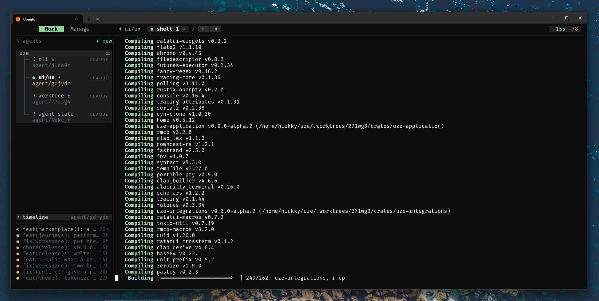

<h1 align="center">.dotfiles</h1>

<p align="center">
  
</p>

<p align="center">
  <a href="https://www.chezmoi.io">
    
  </a>
  <a href="https://uze.hiukky.com">
    
  </a>
  <a href="https://www.zsh.org/">
    
  </a>
  <a href="https://ubuntu.com/wsl">
    
  </a>
  <a href="https://www.microsoft.com/windows">
    
  </a>
</p>

<br>

## 🚀 Install

**🐧 Linux / WSL**

```sh
sh -c "$(curl -fsLS https://hiukky.com/setup.sh)"
```

**🪟 Windows** (works even with no WSL yet), from a normal PowerShell:

```powershell
irm https://hiukky.com/setup.ps1 | iex
```

Same command every time on either OS: first run bootstraps everything from scratch, later runs just pull and apply updates.

## 📦 What it installs

Automated, idempotent provisioning of the whole environment, Linux and Windows alike.

- 🐚 **Shell:** `zsh`, `zinit`, `starship`
- 🧰 **CLI:** `eza`, `bat`, `ripgrep`, `fd`, `fzf`, `tree`, `gh`, `glab`, `glow`, `rtk`, `asciinema`
- ✏️ **Editor:** `vim` (default `$EDITOR`)
- ⚙️ **Runtimes:** `node`, `rust`, `bun`, `flutter`, all via `mise`
- 🐳 **Containers:** `docker`, `kubectl`, `kind`
- 🤖 **Agents:** `claude`, `codex`, `opencode`, and [`uze`](https://uze.hiukky.com) — built from source at `~/uze`, and the owner of this repo's portable [`AGENTS.md`](./AGENTS.md) context
- 🔑 **Accounts:** fresh SSH key per machine plus `gh`/`glab`/`claude` login
- 🪟 **Windows (host, via WSL):** VirtualBox, Android SDK, Discord, Notion, Steam, Spotify, Teams, VLC, CapCut, Chrome, and more
- 🔄 **WSL ⇄ Windows:** a pinned Nerd Font catalog installed on Windows (`nerd-font-lab` to check them), `.wslconfig`, and Windows Terminal `settings.json` kept in sync
- 🔋 **Power:** sleep profile for a machine that used to run 24/7. Windows' idle timer only counts keyboard and mouse input and is blind to WSL, so a guard task vetoes sleep while Linux is genuinely working, and lets it suspend the moment it isn't

## 🛠️ Usage

| Command | What it does |
| --- | --- |
| `chezmoi add ~/.zshrc` | Start tracking an existing file |
| `chezmoi edit ~/.zshrc` | Edit the managed version of a file |
| `chezmoi diff` | Preview what would change before applying |
| `chezmoi apply` | Apply changes to `$HOME` |
| `chezmoi update` | Pull the latest changes and apply |
| `idle-guard status` | Why the machine is (or isn't) being held awake right now |
| `idle-guard report` | What kept it awake lately, and how much it actually slept |
| `idle-guard inhibit 2h` | Force it awake for a while (`release` to drop the hold) |

📄 Full breakdown of conventions and design decisions: [`AGENTS.md`](./AGENTS.md).

## 💻 My setup

| | |
| --- | --- |
| 🧠 CPU | AMD Ryzen 7 5700G |
| 🎮 GPU | NVIDIA GeForce RTX 4060 Ti |
| 🧵 RAM | 64 GB |
| 💾 Storage | 1 TB NVMe + 240 GB SATA SSD |
| 🖥️ OS | Windows 11 + WSL2 (Ubuntu 24.04) |

<p align="center">
  <sub>feito com 🖤 por <a href="https://github.com/hiukky">hiukky</a></sub>
</p>
