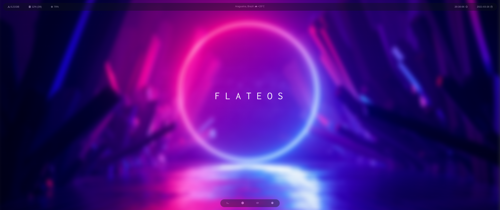

<h1 align="center">Sway Dotfiles</h1>

  

  

   
  
  
  
  
  
  

  Built with ❤︎ by <a href="https://hiukky.com">Hiukky</a>
   

<h2>Details</h2>

    Relevant applications / settings.

<h4>Apps</h4>

<table style="width: 500px;">
  <tr>
    <th>Category</th>
    <th>Name</th>
  </tr>
  <tr>
    <td>Menu</td>
    <td>Ulauncher</td>
  </tr>
  <tr>
    <td>Editor</td>
    <td>VS Code</td>
  </tr>
  <tr>
    <td>Browser</td>
    <td>Brave</td>
  </tr>
  <tr>
    <td>File manager</td>
    <td>Ranger</td>
  </tr>
</table>

<h2>Dotsync</h2>

    A simple executable with automated features to assist in maintaining dotfiles and configuring the system.

 

  

